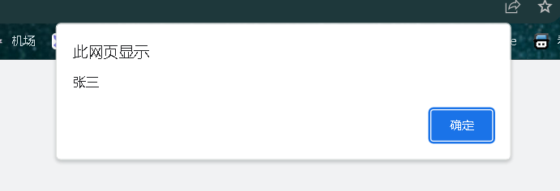
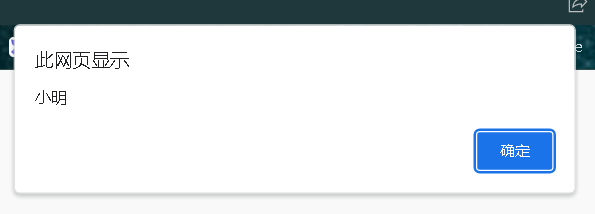
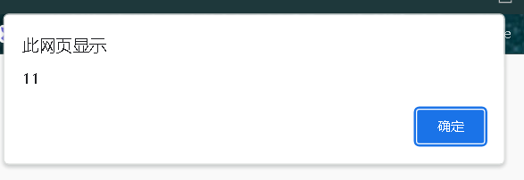

# js变量

> js中的变量是弱类型的，所以声明一个变量可以存储不同类型的值

## var声明

> 声明的格式是var 变量名 = 值，var是variable(变量)的缩写

```html
<script>
    var a = 10;
    a = '张三';
    alert(a);
</script>
```



### var的作用域

> var作用域是<font color='red'>全局</font>，在{}内和{}外都能生效

```js
// 在{}内生效
{
    var x = 10;
    alert(x);
}
```


```js
// 在{}外生效
{
    var x = 'hello world';
}
alert(x);
```


### var重复声明

> 声明的变量可以重复声明，会覆盖之前声明的变量

```js
var a = 1;
var a = '小明';
alert(a);
```



## let声明

> let声明的变量只在let关键字所在的<font color='red'>代码块内有效</font>，且<font color='red'>不能重复声明</font>

```js
{
    let a = 11;
	alert(a);
}
```



```js
// 在{}外let声明变量失效
{
    let a = 11;
}
alert(a);
```


## const声明

> const声明的变量类似常量，一旦定义不可修改，如果修改就会报错

```js
const pi = 3.14;
pi = 3.15;
alert(pi);
```

