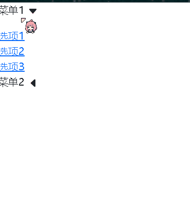

# 抽屉菜单

点击父级菜单，子级菜单展开，再次点击子级菜单收起，像抽屉一样。


>实现需要依赖bs5的js。在父级菜单标签中，需要定义如下属性：
>
>**data-bs-toggle="collapse" ：用于触发 Bootstrap 的折叠组件的一个数据属性。当你给一个元素添加这个属性时，它会告诉 Bootstrap 当该元素被点击时应该触发一个折叠动作，显示或隐藏相关内容。**
>
>**data-bs-target="#menu1" ：是 Bootstrap 折叠组件中的一个属性，用于指定触发折叠行为的目标元素的选择器或 ID。这个属性告诉 Bootstrap 在哪个元素上应用折叠行为，当触发元素（通常是一个按钮或链接）被点击时，目标元素将展开或折叠。**
>
>**aria-expanded="true"：用于辅助技术的 HTML 属性之一，通常与折叠组件一起使用，以提供关于页面元素折叠状态的信息。它指示一个元素（通常是一个具有折叠行为的元素，比如面板或折叠菜单）是否处于展开状态。**

```html
<!DOCTYPE html>
<html>
	<head>
		<meta charset="utf-8">
		<title></title>
		<link rel="stylesheet" href="css/bootstrap.css">
		<script src="js/bootstrap.js"></script>
	</head>
	<body>
		<p class="" data-bs-toggle="collapse" data-bs-target="#menu1" aria-expanded="true">菜单1</p>
		<div class="collapse show" id="menu1">
			<div><a href="#">选项1</a></div>
			<div><a href="#">选项2</a></div>
			<div><a href="#">选项3</a></div>
		</div>
		<p data-bs-toggle="collapse" data-bs-target="#menu2" aria-expanded="true">菜单2</p>
		<div class="collapse" id="menu2">
			<div><a href="#">选项1</a></div>
			<div><a href="#">选项2</a></div>
			<div><a href="#">选项3</a></div>
		</div>
	</body>
</html>
```


# 抽屉菜单+旋转图标

> 如果你需要一个图标或其他来辅助抽屉菜单的展开或收起，效果如下：



> 那么你需要使用css的动画过渡效果来实现，简单来说就是让图标旋转起来。
>
> **.isRotate：用来控制目标旋转及旋转所用时间，如果你想让你的图标或者其他标识抽屉菜单展开或者收起时旋转来辅助渲染，那么你需要在你的图标中定义这个类。**
>
> **.trgCollapse：用来触发图标旋转的类，如果你想点击父级菜单实现旋转的效果，就在父级菜单中定义这个类，需要注意的是，这个类与aria-expanded=""属性绑定，所以请保证你的父级菜单标签中定义了该属性。**
>
> **trgCollapse和dis-trgCollapse：简单来说，如果aria-expanded="true"，那么trgCollapse和dis-trgCollapse会使你的图标旋转0°也就是不旋转图标。如果aria-expanded="false"，那么trgCollapse会使你的图标顺时针旋转90°，而dis-trgCollapse会使你的图标逆时针旋转90°，这个度数是在transform: rotate()中设置的，默认正为顺时针负为逆时针**

```html
<!DOCTYPE html>
<html>
	<head>
		<meta charset="utf-8">
		<title></title>
		<link rel="stylesheet" href="css/bootstrap.css">
		<script src="js/bootstrap.js"></script>
		<style>
			.isRotate {
				/* 控制动画执行时间，0.35秒 */
				transition: transform 0.35s ease;
			}
			/* .parent .child，它会匹配.parent元素下的所有.child元素，不论它们的深度如何。 */
			.trgCollapse[aria-expanded="true"] .isRotate,
			.dis-trgCollapse[aria-expanded="true"] .isRotate {
				transform: rotate(0);
			}

			.trgCollapse[aria-expanded="false"] .isRotate
			 {
				transform: rotate(90deg);
			}
            .dis-trgCollapse[aria-expanded="false"] .isRotate{
                transform: rotate(-90deg);
            }
		</style>
	</head>
	<body>
		<p class="trgCollapse" data-bs-toggle="collapse" data-bs-target="#menu1" aria-expanded="true">
			菜单1
			<svg xmlns="http://www.w3.org/2000/svg" width="16" height="16" fill="currentColor"
				class="bi bi-caret-down-fill isRotate" viewBox="0 0 16 16">
				<path
					d="M7.247 11.14 2.451 5.658C1.885 5.013 2.345 4 3.204 4h9.592a1 1 0 0 1 .753 1.659l-4.796 5.48a1 1 0 0 1-1.506 0z" />
			</svg>
		</p>
		<div class="collapse show" id="menu1">
			<div><a href="#">选项1</a></div>
			<div><a href="#">选项2</a></div>
			<div><a href="#">选项3</a></div>
		</div>
		<p class="trgCollapse" data-bs-toggle="collapse" data-bs-target="#menu2" aria-expanded="false">
			菜单2
			<svg xmlns="http://www.w3.org/2000/svg" width="16" height="16" fill="currentColor"
				class="bi bi-caret-down-fill isRotate" viewBox="0 0 16 16">
				<path
					d="M7.247 11.14 2.451 5.658C1.885 5.013 2.345 4 3.204 4h9.592a1 1 0 0 1 .753 1.659l-4.796 5.48a1 1 0 0 1-1.506 0z" />
			</svg>
		</p>
		<div class="collapse" id="menu2">
			<div><a href="#">选项1</a></div>
			<div><a href="#">选项2</a></div>
			<div><a href="#">选项3</a></div>
		</div>
	</body>
</html>
```

