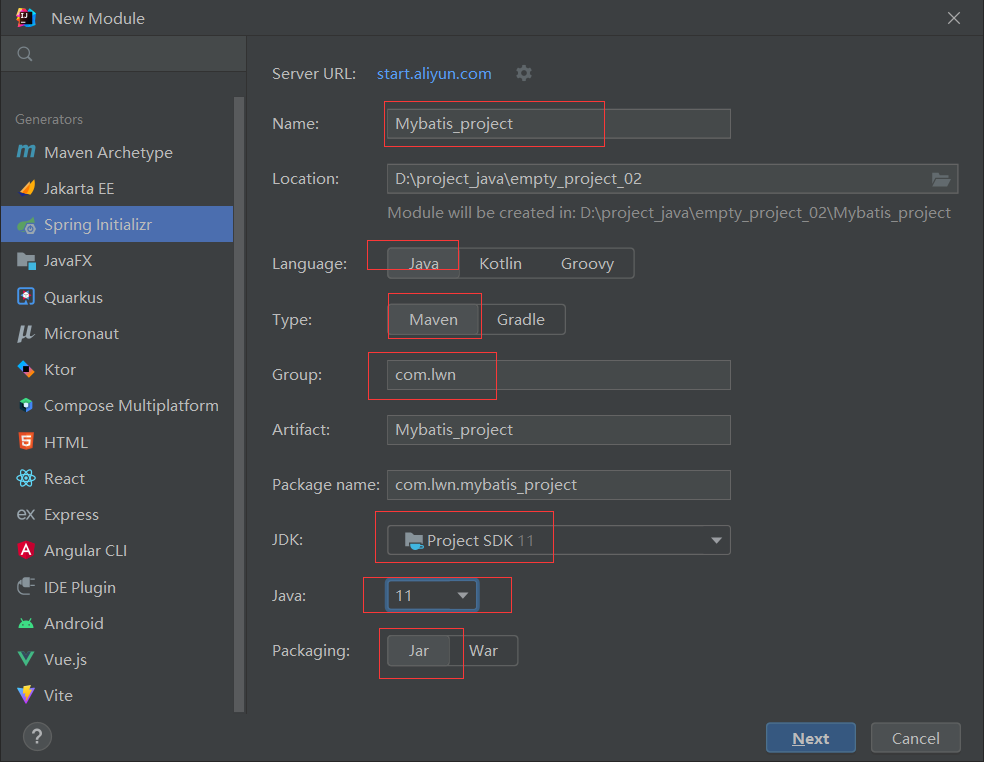
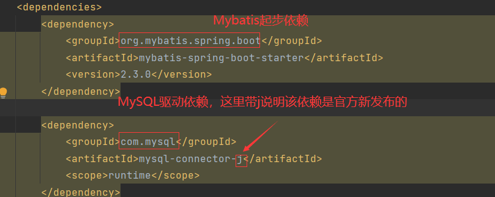
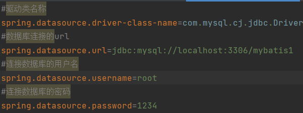
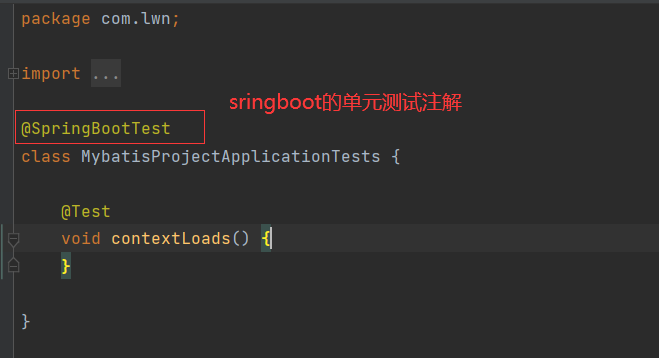
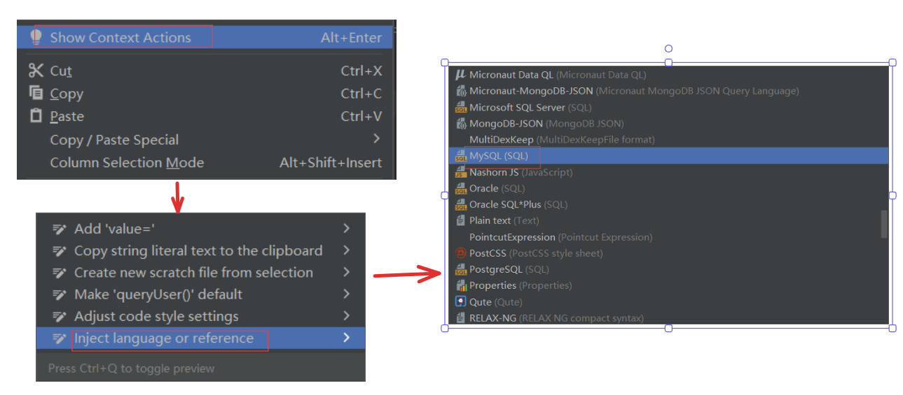
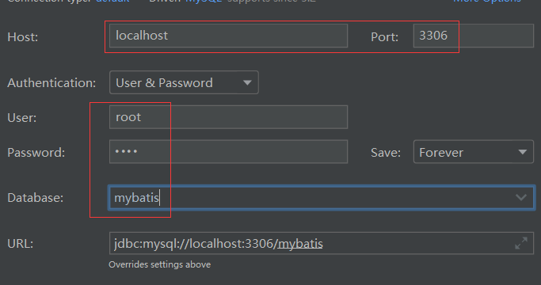
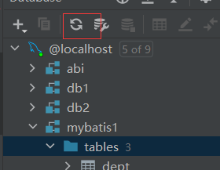

# 快速入门

> 使用Mybatis查询所有用户的数据。
>
> 之前我们通过sql语句来操作数据库，Mybatis底层也是通过sql来访问数据库。Mybatis操作数据库的步骤：
>
> 1. 准备工作(创建springboot工程、数据库表user、实体类User)
> 2. 引入Mybatis的相关依赖， 配置Mybatis
> 3. 编写SQL语句(注解/XML)
>
> 使用Mybatis操作数据库，数据库返回的结果我们建议用一个实体类来封装，类中的属性与数据表的字段名保持一致。
>
> 创建springboot工程时选择数据库依赖和Mybatis依赖。
>
> Mybatis操作数据库，Mybatis就得知道操作哪个数据库，因此要配置连接信息，也就是数据库的ip、端口、用户名和密码等，跟我们用idea的图形化界面工具连接数据库一样，这些配置信息在springboot的默认配置文件application.properties中配置。
>
> 在Mybatis中编写sql语句有两中方式，第一种就是通过注解来定义，第二种通过XML文件来定义，在入门阶段我们暂时使用注解式定义。
>
> Mybatis官方推荐我们使用一个Mapper接口来访问持久层，所谓的Mapper接口其实就是我们以前接触过的Dao层中的Dao接口，只是这里换了个名字而已，定义Mapper接口不需要实现该接口，因为Mybatis底层会自动创建该接口的实现类。


## 创建工程

> 创建springboot工程，选择数据库依赖和Mybatis依赖：




> pom中的依赖：




## 创建实体类

> 根据表结构创建相应的实体类：


> 实体类：

```java
package com.lwn.entry;

public class User {
    private Integer id; // 实体类中推荐定义Integer类型
    private String name;
    // age和gander都是tinyint类型，所有在这里定义Short类型就行了
    private Short age;
    private Short gander;
    private String phone;

    public User() {
    }

    public User(Integer id, String name, Short age, Short gander, String phone) {
        this.id = id;
        this.name = name;
        this.age = age;
        this.gander = gander;
        this.phone = phone;
    }

    @Override
    public String toString() {
        return "User{" +
                "id=" + id +
                ", name='" + name + '\'' +
                ", age=" + age +
                ", gander=" + gander +
                ", phone='" + phone + '\'' +
                '}';
    }

    public int getId() {
        return id;
    }

    public void setId(Integer id) {
        this.id = id;
    }

    public String getName() {
        return name;
    }

    public void setName(String name) {
        this.name = name;
    }

    public int getAge() {
        return age;
    }

    public void setAge(short age) {
        this.age = age;
    }

    public int getGander() {
        return gander;
    }

    public void setGander(short gander) {
        this.gander = gander;
    }

    public String getPhone() {
        return phone;
    }

    public void setPhone(String phone) {
        this.phone = phone;
    }
}
```


## 配置数据库连接信息

> 在application.properties中配置数据库的连接信息，配置文件中以key = value的形式配置。
>
> 配置数据库的连接信息比较固定，分为4要素
>
> - 驱动类名称
> - 数据库连接的url
> - 用户名
> - 密码

```properties
# 驱动类名称，这里是MySQL驱动
spring.datasource.driver-class-name=com.mysql.cj.jdbc.Driver

# 数据库连接的url
# 这里连接本地的mybatis1数据库
spring.datasource.url=jdbc:mysql://localhost:3306/mybatis1

#连接数据库的用户名
spring.datasource.username=root

#连接数据库的密码
spring.datasource.password=1234
```




## 编写sql语句

> 创建Mapper接口，以注解的方式编写sql：

```java
package com.lwn.mapper;

import com.lwn.entry.User;
import org.apache.ibatis.annotations.Mapper;
import org.apache.ibatis.annotations.Select;

import java.util.List;

@Mapper // 标注这个接口是一个Mapper接口，运行时Mybatis会自动为其创建实现类对象，并且将对象交给IOC容器管理
public interface UserMapper {
    @Select("select * from user")
    public List<User> queryUser();
}
```

> 首先在接口上加上@Mapper，标注这个接口是一个Mapper接口，这样运行时Mybatis会自动为其创建实现类对象，并且将对象交给IOC容器管理。
>
> 然后在方法上标注@Select注解，表示执行查询语句，在注解中编写查询的sql


## 测试

> maven项目中有专门用于测试的包，test包，我们在这个包下测试，这个类MybatisProjectApplicationTests是springboot专门用来测试的类：




> @SpringBootTest是springboot整合的单元测试注解
>
> 查询测试：

```java
package com.lwn;

import com.lwn.entry.User;
import com.lwn.mapper.UserMapper;
import org.junit.jupiter.api.Test;
import org.springframework.beans.factory.annotation.Autowired;
import org.springframework.boot.test.context.SpringBootTest;

import java.util.Iterator;
import java.util.List;

@SpringBootTest
class MybatisProjectApplicationTests {

    @Autowired
    // Mybatis在运行时会创建Mapper接口实现类，并交给IOC容器管理，成为Bean
    // 使用依赖注入拿到Bean对象
    private UserMapper userMapper;

    @Test
    public void test1() {
        List<User> users = userMapper.queryUser();
        // 使用List集合的stream流来遍历集合
        users.stream().forEach((user) -> {
            System.out.println(user);
        });
    }

}
```

> 结果：


# 配置sql提示

> 上面的案例中，我们使用了@Select注解来编写查询的sql，虽然它是一条sql，但是对于目前的idea来说是无法识别的，idea只会当他是一个字符串，即使sql写错了，idea也不会给出语法报错，但是在运行时就会出错。
>
> 在idea中是可以配置这个sql提示的。
>
> 我们选中这条sql语句，右键【Show Context Actions】>>【Inject language or reference】>>【MySQL】



> 此时的sql已经高亮显示了，但是user表包红色，因为这是初次设，数据库与idea并未建立连接：


> 配置数据库与idea的连接，右侧【Database】>>【+】>>【Data Source】>>【MySQL】：


> 然后指定连接的地址、端口、用户名、密码和连接的数据库：



> 现在user表就能被idea识别了：


> 如果还是爆红，就刷新：



> sql语法错误也会提示：


