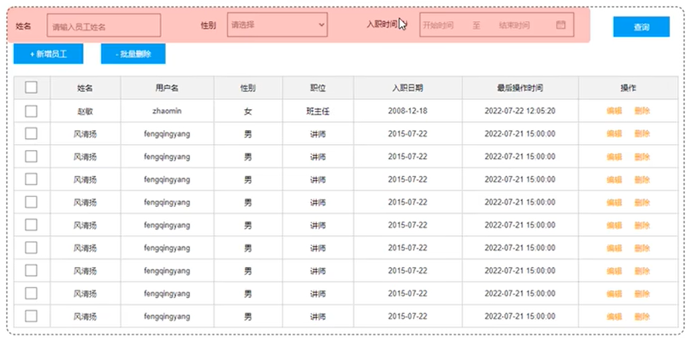
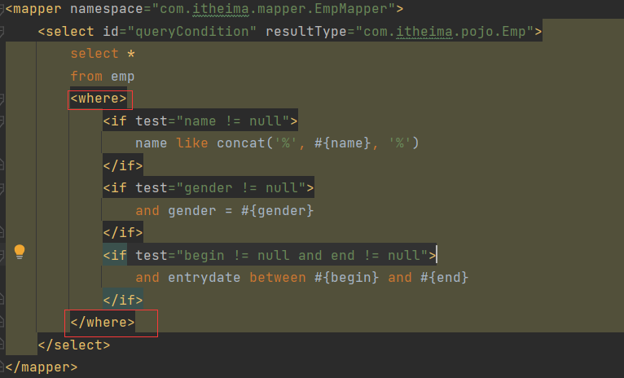
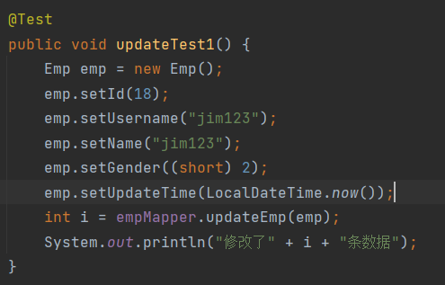
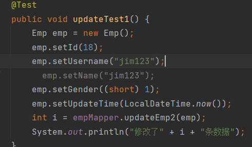
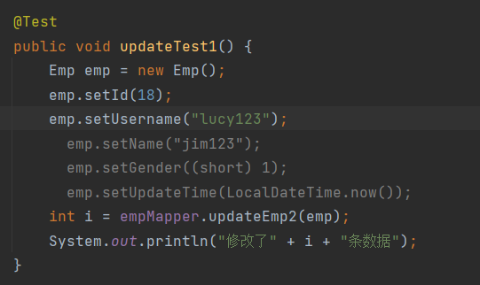
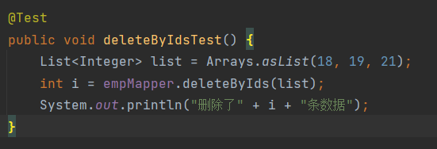
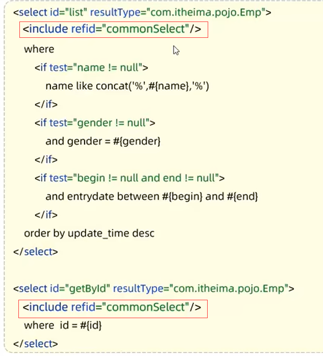
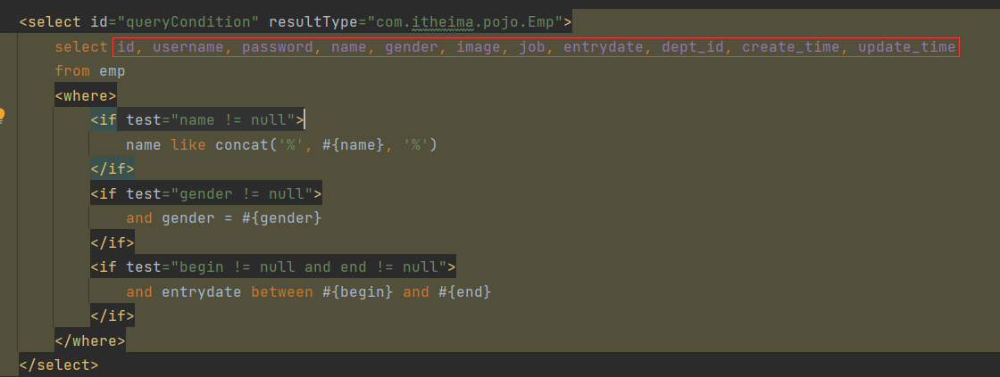
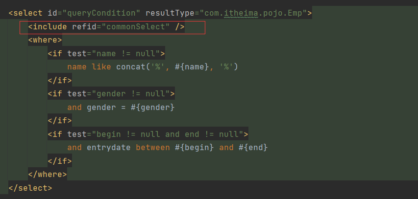

# 动态SQL

> 随着用户的输入或外部条件的变化而变化的SQL语句，我们称为动态SQL。
>
> 如，条件查询员工：



> 当我不选条件时，能查询出所有数据，当我选一个条件时，能查询出一个条件对应的数据，当我选2个、3个条件时，也能查出对应数据，这就要要求条件是动态的。
>
> 条件查询SQL：


> 这里我将3个条件写死，当我不传入参数时，它们都是null，也就都查不出数据。
>
> 测试，无结果：


> 我们想要的功能是，选几个条件，就以几个条件来查询。


# if

> if是Mybatis提供的动态SQL标签之一，是条件判断标签。
>
> 如果条件成立，则拼接SQL，否则省略。
>
> 用test属性进行条件判断

```xml
<if test='条件表达式'>
	SQL
</if>
```

> 如：

```xml
<if test='name != null'>
	name like concat('%', #{name}, '%')
</if>
```

> 只有当name不为null时，才会拼接这条SQL。
>
> 基于if，来改造条件查询员工SQL：


> 现在再测试，只根据name，也能查询出数据，且预编译时只有一个?：


> 但是，如果我不传入name参数，就会报错：


> 语法错误，最终的SQL：


> where后面直接跟了个and，因为name是null，所以没有拼接name的条件，如果我们在gender条件上不加and，显然也不行，因为name和gender都不为null时，它们之间就没有and关键字，任然会报错。
>
> 条件前面多余一个and，甚至所有条件都不成立时还会多余一个where
>
> 如何解决？通过where标签。


## where

> where标签用来替换where关键字：

```xml
<where>
    <if test="条件表达式">
        SQL
    </if>
    <if test="条件表达式">
        SQL
    </if>
    ...
</where>
```

> - <font color='red'>where标签会判断内部的条件，如果所有条件都不成立，则不会生成where，只要有一个成立，就生成。</font>
> - <font color='red'>会自动去除条件前面的and和or关键字。</font>



> 测试，成功：


# set

> 更新员工信息，只局部信息更新：



> 将员工id=18的员工信息修改，只修改用户名、姓名、性别和修改时间字段：


> 数据被修改，但是部分字段为null了：


> 因为我们只修改了用户名、姓名、性别和修改时间，而其他字段时没有修改的，但是我们的SQL：


> 定义了这些字段，导致没有值就传入了null，将原值修改成了null。因此修改也需要动态SQL。
>
> 我们使用if改造，创建updateEmp2方法，使用MybatisX插件提供的功能，选中方法名alt+回车，选【 Generate statement】，就会自动生成该方法的XML的SQL配置：


> 会自动将id设置成方法名，同时会检查方法名，如果带有update就会生成update标签。如果方法名无法确定是增删改查的哪个，就会弹出选项让我们自己选：


> 用if改造成动态SQL：


> 再次执行，我不改姓名：




> 姓名没有被null修改，最终的SQL，动态生成的修改：


> 现在，我只修改username：




> 报错了，SQL语法错误，最终SQL：


> 原因是因为只修改username，其他字段不修改，导致username之后直接跟上的是where，但是username后面还有一个,。如果删除,修改之间就没有,间隔，任然是语法错误，这就需要set标签来解决。

```xml
<set>
    <if test="条件表达式">
        SQL
    </if>
    <if test="条件表达式">
        SQL
    </if>
    ...
</set>
```

> - <font color='red'>set标签替换set关键字，会自动去除修改后面多余的逗号</font>
> - <font color='red'>set标签检查内部的条件，如果都不成立，则不会生成set，只要有一个成立就生成</font>


> 测试，成功：


# foreach

> foreach标签用于循环遍历。
>
> 在批量删除功能中，我们选中员工的复选框，将选中的员工都删除，比如，我们删除id为18到21的员工：


> 使用Mybatis来完成这个需求，定义批量删除的方法，多个id，参数一般使用集合或者数组，这里使用集合：


> 此时，id时写死的，我们得拿到方法中的id集合然后遍历出id并拼接在SQL上，id之间使用,同时要加上前括号和后括号。
>
> 使用foreach标签进行循环遍历，foreach中的常见属性：
>
> - <font color='red'>collection：要遍历的集合</font>
> - <font color='red'>item：遍历出来的元素</font>
> - <font color='red'>separator：分隔符</font>
> - <font color='red'>open：遍历开始前拼接的SQL片段</font>
> - <font color='red'>cloes：遍历结束后拼接的SQL片段</font>
>
> 集合就是ids，而遍历出的元素就是id，分隔符用,分隔，在开始后结尾要加上前括号和后括号，因此：


> 测试：




# sql和include

> 来看这段XML：


> 两个查询中都查询了相同的字段，也就是出现了相同的SQL片段，在以后如果要改表名或者表的字段名，那么上面要修改，下面也要修改，非常麻烦，代码的复用性不高，我们可以将重复的部分提取出来，然后在提取的地方再引入就行了。
>
> 这就要用到sql和include标签。
>
> sql标签就负责提取这个SQL片段，然后为这个片段定义唯一标识：


> include标签就在原来的地方引入这个片段，按照唯一标识来引入，通过refid属性来指定：



> - <font color='red'>sql：抽取重复SQL片段，id属性指定唯一标识</font>
> - <font color='red'>include：引入抽取的片段，refid属性指定唯一标识来引入</font>
>
> 抽取：




> 引用：



> 测试：


# 注意

> - 用\<if test="">\</if>进行条件判断时，如果判断的变量是字符串类型的，建议加上不等于""的判断，因为在springboot中，String类型的请求参数，如果没有指定值，那么它有默认值""而不是等于null。