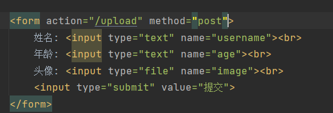
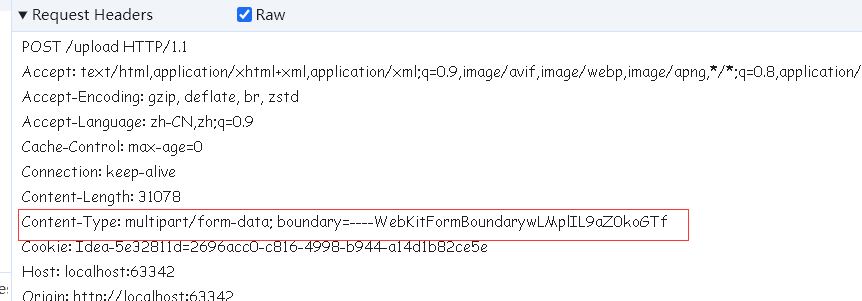
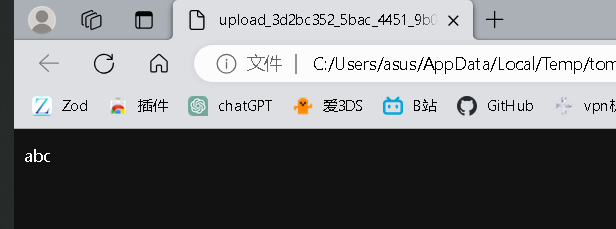
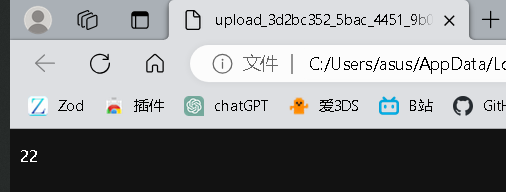

# 文件上传

> 文件上传，是指将本地图片、视频、音频等文件上传到服务器,供其他用户浏览或下载的过程。
>
> 文件上传在项目中应用非常广泛，我们经常发微博、发微信朋友圈都用到了文件上传能。
>
> 文件上传分为两部分，一部分是前端、一部分是后端。


## 前端文件上传3要素

> 前端中文件要上传有3要素：
>
> 1. 必须定义from表单和input，且input的type属性 = file
> 2. 表单的提交方式必须是POST
> 3. 必须指定from标签的enctype属性 = multipart/from-data


## from上传文件演示

> 定义一个简单的文件上传from表单：

```html
<!DOCTYPE html>
<html lang="en">
<head>
    <meta charset="UTF-8">
    <title>上传文件</title>
</head>
<body>
	<!-- 请求路径/upload -->
    <form action="/upload" method="post" enctype="multipart/form-data">
        姓名: <input type="text" name="username"><br>
        年龄: <input type="text" name="age"><br>
        头像: <input type="file" name="image"><br>
        <input type="submit" value="提交">
    </form>

</body>
</html>
```

> 我们先不定义enctype="multipart/form-data"：



> 在页面中，我们填写好数据，然后选择文件上传，这里选择的是文本文件，大小是30KB


> 提交，然后抓取网络请求查看：


> 在请求头中有这样的子内容：Content-Type: application/x-www-form-urlencoded
>
> 在from表单中，enctype属性未指定值时，它默认值就 = application/x-www-form-urlencoded
>
> 而Content-Type指的是请求体的类型，我们可以查看application/x-www-form-urlencoded格式(from表单默认编码格式)的请求体长什么样：


> image参数的值 = %E4%B8%AD%E5%9B%BD%E6%A2%A6.txt
>
> 这个"%E4%B8%AD%E5%9B%BD%E6%A2%A6.txt"是文件"中国梦.txt"的文件名URL编码后的结果。
>
> 我们可以发现，当使用from的默认编码格式后，提交的仅仅是文件的文件名，文件的内容并没有提交。


## multipart/form-data的请求数据格式

> 使用multipart/form-data再次上传：


> 请求头Content-Type: multipart/form-data，后面跟了一个参数boundary。
>
> boundary是分隔符(也称multipart边界)，如果from设置了multipart/form-data，此时的from提交数据是分成多个部分来提交的。每一个表单项(输入框、单选框、下拉框等)都是一个部分，而多个部分之间会使用浏览器自动生成的分隔符boundary进行分隔。



> 然后查看请求数据：


> 分了这么几个部分：


> 第3部分就是我们提交的文件的信息，为什么有3个部分？因为我们from中有3个表单项。
>
> 这里再说一遍，当使用multipart/form-data后，from提交数据，有几个表单项，数据就被分成几部分。
>
> 另外，----WebKitFormBoundaryV5fsFAmOJHh76jMk这个其实就是分隔符：


## 后端接收文件

> - <font color='red'>使用MultipartFile作为文件类型</font>
> - <font color='red'>文件形参名与请求参数名一致</font>
>
> 对于普通的表单项，控制器接收：


> 对于文件项我们可以使用springboot提供的API：MultipartFile，且要想成功接收文件，要保证形参名与文件项的参数名一致：


> 我们启动程序，访问该页面进行测试：


> 文件已经被封装进了MultipartFile中。
>
> 在part.location中显示的就是文件的存放目录


> 打开这个目录：


> 有3个临时文件，为什么有3个，因为我们提交的表单项就是3个。
>
> 我们打开30KB的文件，把文件改成txt，这就我们提交的文本文件：

-1714308561775-2.gif)

> 另外两个：





> 然后放行程序：


> 此时，临时文件已经被删除了(aaa.txt没被删除时我将.tmp改成了.txt)，也就是说上上传的请求响应完成后，临时文件会被自动删除。
>
> 所以，我们不光要接收文件，还要保存文件。