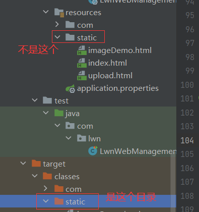
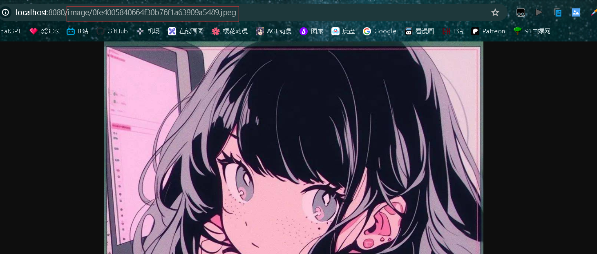
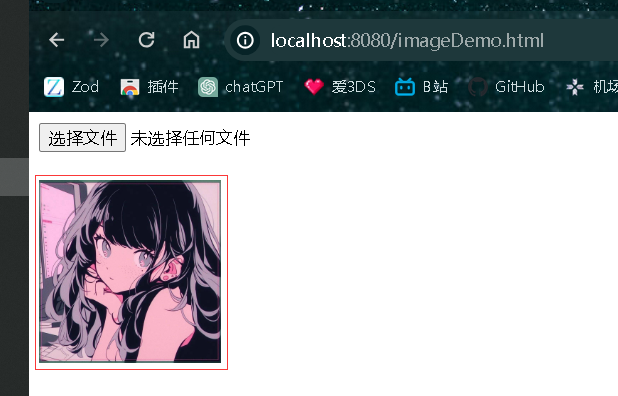

# 本地存储目录设置

> 上文中，我们上传文件时，是将文件保存在本地，但是这会造成前端无法访问的问题，因为我们的项目要么前后端分离，要么是前后端不分离，但是不管分不分离，前端项目都是跑在服务器上的，并不是在本地运行的，所以使用的协议必然不是本地协议。所以我们的保存路径不应该设置为本地路径，而是将保存路径设置为服务器路径，或者使用第三方存储平台。保证与前端服务器使用的协议相同。
>
> 在springboot中，我们推荐将存储路径定义在static目录下。
>
> 注意，这里的static目录不是resources/static，而是target/classes/static，即编译项目后的目录：



> 为什么要定义在编译后的目录下？因为java运行的不是java文件而是java文件编译后的字节码文件即class文件。maven项目在运行时会先编译生成target包，最终运行的就是target包下面的程序，因此要将文件存放目录定义在target/classes/static。
>
> 而且，即便我们在测试环境中将存放目录定义在resources/static，在编译时resources/static下的文件目录也会被复制到target/classes/static下：

.gif)


# 获取类路径下资源目录的路径

```java
// 获取ResourceUtils的类加载器
ClassLoader classLoader = ResourceUtils.class.getClassLoader();
// 获取类路径下static的URL对象
URL targetStatic = classLoader.getResource("static");
// 通过URL对象获取对应的路径
String path = targetStatic.getPath();
```

> 使用ResourceUtils获取target/classes/static的路径：


# 静态资源映射

> 我们了解到了文件保存在target/classes下的资源目录中，因此我们可以直接通过HTTP请求访问服务请器上的资源，比如static/image下的图片：
>
> 其路径：target/classes/static/image/0fe4005840664f30b76f1a63909a5489.jpeg
>
> 访问：
>
> http://localhost:8080/static/image/0fe4005840664f30b76f1a63909a5489.jpeg
>
> 但是页面无法显示，报错404：


> 这是因为，在项目编译后，target/classes可以存在四个资源目录
> 按照访问顺序从上到下排列
> 1、/META-INF/resources
> 2、/resources
> 3、/static
> 4、/public
>
> static是其中一个，我们编译后默认生成static，这些资源目录的名称是约定好的，不能改变。当我访问：
>
> localhost:8080/image/0fe4005840664f30b76f1a63909a5489.jpeg的时候，会依据/路径之后开始的路径（这里是image/0fe4005840664f30b76f1a63909a5489.jpeg），到资源目录中按顺序查找该路径指定的资源。
>
> 即，对于要请求的图片资源，会先到META-INF/resources下去查找有没有image目录，如果有就再查找有没有图片，如果有就返回该资源，如果没有图片，就到resources下查找。如果一开始连image目录也没有，就直接会到resources下去查找。resources中又重复META-INF/resources中的方式，查找图片，有就返回，没有就到static中去查找，剩下的以此类推，直到最后一个public。假如都没有找的，那么就什么也不返回。页面会报404（找不到URL对应的资源或页面）
>
> 这也就是解释了为什么访问lstatic/image/0fe4005840664f30b76f1a63909a5489.jpeg时会显示404。因为我们定义的URL中image前多了一个static，所以，程序会到static下先查找static目录，而不是image目录。 


> 我们直接访问：
>
> http://localhost:8080/image/0fe4005840664f30b76f1a63909a5489.jpeg



> 通常，编译后target/classes下的静态资源目录只有一个，一般是static，只有一个时，查找的时候也就只会去查找这个目录。
>
> 当存在多个静态资源目录，且要请求的资源两个目录下都有的时候，如resources和static下都有image/0fe4005840664f30b76f1a63909a5489.jpeg时（同名但不一定内容一样），会按照顺序来返回，resources在static之前，因此返回的是resources下的图片。
> 上面说到的顺序是springboot默认的，我们是可以进行配置更改顺序的。

-1714652750060-3.gif)


> 因为resources/static会被映射到根路径后面，即：
>
> http://localhost:8080/resources/static/image
>
> 会变成
>
> http://localhost:8080/image
>
> 现在再次访问，访问成功：



> 这里介绍一下如何获取springboot项目中