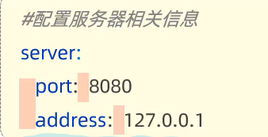
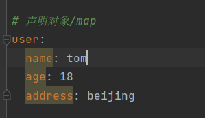
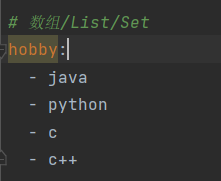
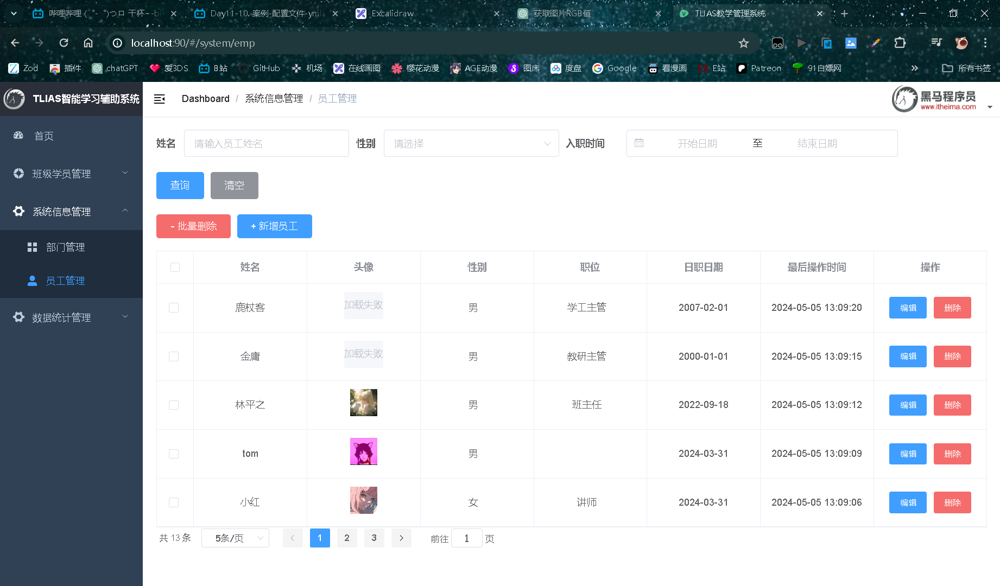

> springboot中支持使用多种配置方式，之前我们一直使用properties文件，其文件名是固定的就叫application.properties。而properties的配置形式是key=value。
>
> 接下来我们介绍springboot种另一种配置文件，yml格式配置文件。


# yml格式

> yml格式的配置文件后缀名：
>
> - 可以是.yml，如：application.yml
> - 也可以是.yaml，如：application.yaml
>
> 这两种配置文件仅仅是后缀名不同，它们的配置形式都是key : value。而且不管是yml还是yaml，它们的前缀都得叫application，与properties一样。
>
> yml格式的配置文件格式是key : value，且key是按照层级书写的，如配置IP和端口：

```properties
# properties
server.address=127.0.0.1
server.port=8080
```

```yaml
# yml
server:
	address: 127.0.0.1
	port: 8080
```

> yml格式，我们需要先配置第一级server然后以:分隔，然后回车配置第二级address然后:分隔，<font color='yellow'>空格</font>后才定义值。每个层级之间有缩进，缩进相同，层级相同。
>
> 创建yml文件，配置端口：


## 常见配置文件对比


> 对比可以看出，XML格式最麻烦，较为臃肿，properties较XML轻量化，但是在开发种我们使用大量第三方框架，需要在配置文件中配置信息，就要要求key值见名知意，并具有一定的标识意义，因此key值通常都是分层级的，所以properties较于yml/yaml的key没有清晰的分层。
>
> 因此更推荐使用yml格式的配置文件，而yml中我们一般使用yml后缀名。


## 基本语法

> - 大小写敏感
> - :和value之间必须有空格，作为分隔符
> - 使用缩进表示层级关系，缩进时，不允许使用Tab键，只能用空格(idea中会自动将Tab转换为空格)
> - 缩进的空格数目不重要，只要相同层级的元素左侧对齐即可
> - #表示注释，从这个字符一直到行尾，都会被解析器忽略




## yml的数据类型

> yml中常见的两类数据格式：
>
> 1. 对象/map集合
> 2. 数组/List、Set集合


### 对象/map

```yaml
user:
	name: zhangsan
	age: 18
	password: 123456
```

> 如：




### 数组/List/Set

```yaml
hobby:
	- java
	- python
	- c
	- c++
```

> 定义数组、List、Set，其内部元素前面要加-，-与元素值之间有空格，如：



> 在文件下面有提示：


> hobby表示这个数组(List、Set)的名字是hobby，item表示数组中的元素，2/4表示数组一共4个元素，现在鼠标指向第2个元素，python表示当前元素值为python


# 使用yml替换properties

> 将properties中的配置选项替换成yml格式：

```yaml
# 端口
server:
  port: 8080


# mybatis
mybatis:
  mapper-locations: classpath:mappers/*xml
  type-aliases-package: com.lwn.mybatis.entity
  configuration:
    # 开启日志
    log-impl: org.apache.ibatis.logging.stdout.StdOutImpl
    # 开启驼峰命名映射
    map-underscore-to-camel-case: true


spring:
  # 数据源
  datasource:
    # mysql连接信息
    driver-class-name: com.mysql.cj.jdbc.Driver
    url: jdbc:mysql://localhost:3306/lwn
    username: root
    password: 1234
  servlet:
    # 文件上传配置
    multipart:
      # 单文件上传最大10MB
      max-file-size: 10MB
      # 单次请求最大文件100MB
      max-request-size: 100MB

# 阿里云配置
aliyun:
  # OSS对象存储
  oss:
    # 地域IP
    endpoint: https://oss-cn-hangzhou.aliyuncs.com
    # bucket名称
    bucketName: lwn-management
```

> 程序正常运行：

