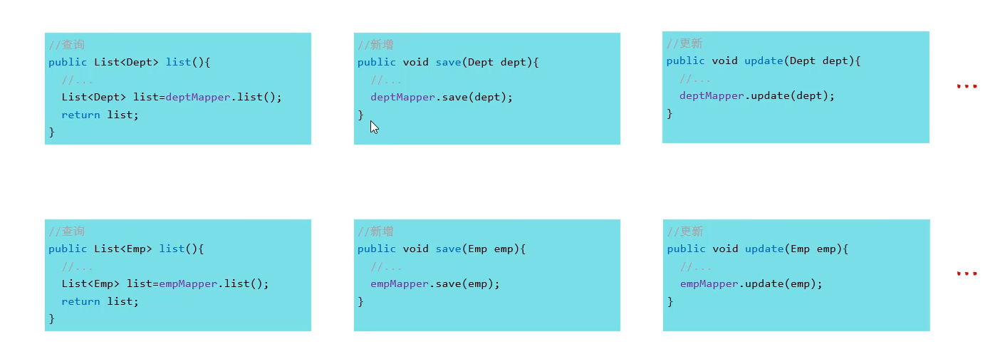
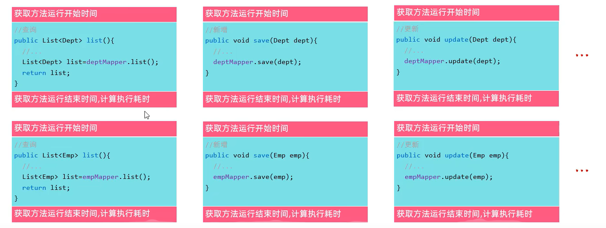
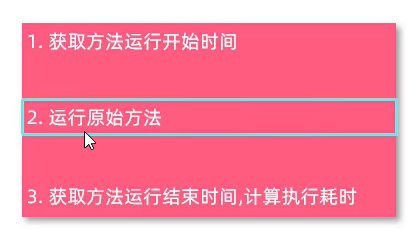
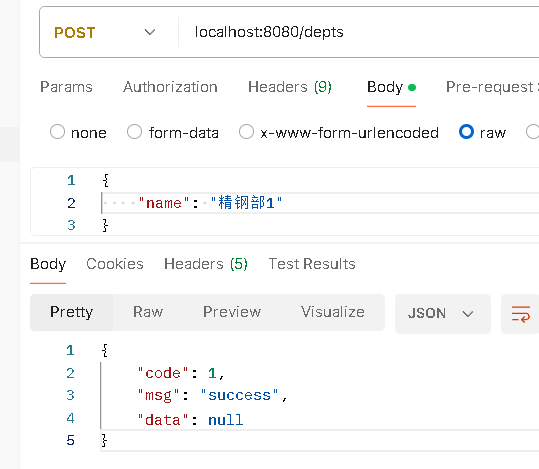
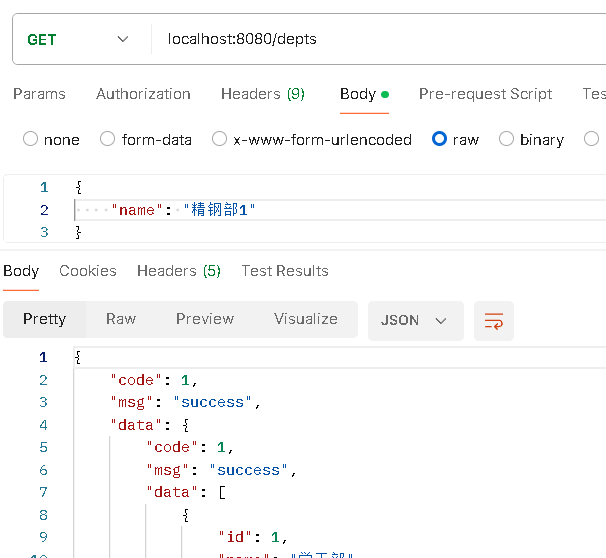
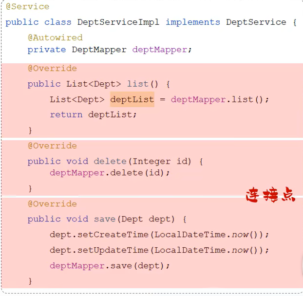
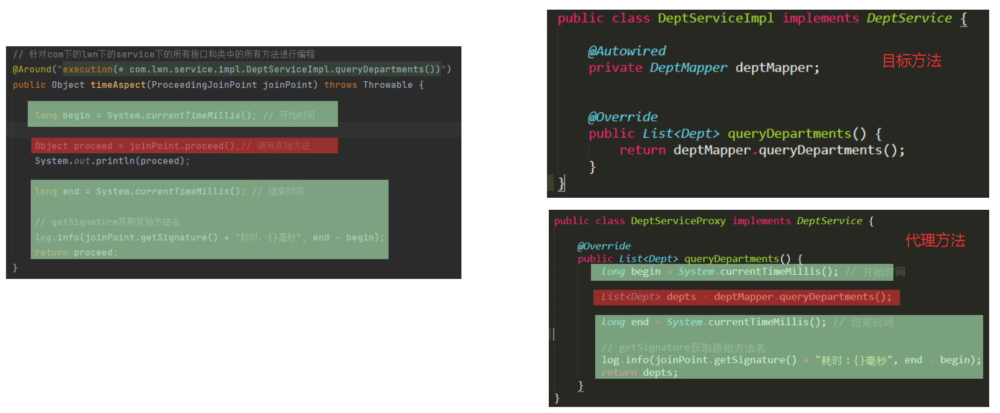
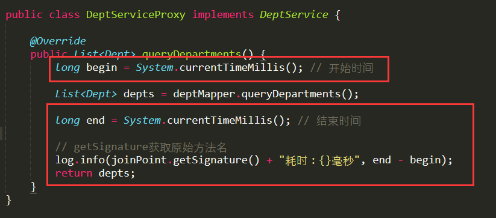

# AOP

> AOP: Aspect Oriented Programming (面向切面编程、面向方面编程)，其实就是<font color='yellow'>面向特定方法</font>编程。
>
> 为什么需要AOP？举个例子：
>
> 一个项目中开发了很多功能，此时我们的系统运行比较慢，我们需要对业务方法进行优化，那么我们就需要定位出耗时较长的业务方法，因此我们需要统计每个业务方法的运行时间。



> 最简单的方法就是在每个业务方法中记录方法开始运行时候的时间和放行运行结束后的时间做差。



> 可是，对于一个大型项目来说，它包含很多业务模块。每个模块下面又包含很多业务方法，如果为每个方法都记录开始执行时间和结束时间，那么这样的操作很繁琐，而且代码也很臃肿。
>
> 使用AOP面向切面，我们可以做到在不改的原始方法的情况下对原始方法进行变化。这个变化可以是对原始方法的增强，也可以是改变原始方法的功能。
>
> 而我们要统计各个方法的执行耗时，我们只需定义一个模板方法，然后将统计方法执行耗时这部分公共的逻辑代码，定义在模板方法中：


> 我们就可以在方法开始运行之前，记录开始时间，然后在方法结束运行的时候记录结束时间，而中间就运行我们的原始方法：



> 这里的原始方法，就是需要统计执行耗时的方法。
>
> 像这种面向一个或多个方法编程，我们就称之为面向切面编程。
>
> 定义好模板后，项目运行时，比如list这个方法，程序并不会执行原始的list方法，而是会自动的去执行模板方法，模板方法在运行时，就会先去统计开始时间，然后再执行原始方法，这里是list方法，最好再执行结束时间。


## 实现原理

> 这样的流程跟动态代理很相似。其实，模板方法中定义的逻辑就是创建出来的代理对象中的方法中的逻辑。而在代理方法中，我们可以根据业务需要在原始方法执行之前和之后做一些事情。
>
> 所以AOP最主流的实现方式就是动态代理。
>
> 动态代理是面向切面编程最主流的实现。而SpringAOP是Spring框架的高级技术，旨在管理bean对象的过程中，主要通过底层的动态代理机制，对特定的方法进行编程。
>
> 简单来讲，SpringAOP就是通过动态代理，完成针对于特定方法的编程。


# 快速入门

> 统计各个业务层方法执行耗时。
>
> 分为两步：
>
> 1. 导入AOP依赖
> 2. 编写AOP程序，针对特定方法根据业务需求进行编程。
>
> 1、导入AOP依赖：

```xml
<!--AOP-->
<dependency>
    <groupId>org.springframework.boot</groupId>
    <artifactId>spring-boot-starter-aop</artifactId>
</dependency>
```

> 针对特定方法根据业务需求进行编程。我们主要就是来定义模板方法。这样的方法肯定得定义在类中，所以我们需要创建一个类，然后将这个类交给IOC。而且这个类不是一个普通类，我们还需要在类上声明@Aspect来表示当前类是一个AOP类。然后在这个类中定义模板方法。
>
> 在这个方法中我们就需要完成3步操作：
>
> 1、记录开始时间，获取当前时间的毫秒值。
>
> 2、调用原始方法，要想调用原始方法，我们需要在类的形成中声明ProceedingJoinPoint的对象，然后通过该对象的proceed()方法来调用原始方法，调用proceed就是在调用原始方法。
>
> 3、记录结束时间，获取当前时间的毫秒值。


> 这个AOP类我们写好了，模板方法也写好了，但是这个AOP类应该针对哪些特定方法进行编程？
>
> 这就需要在模板方法上加上注解@Around。
>
> 然后@Around中通过一个表达式的形式来指定对于哪些特定的方法进行编程：


> 对这个表达式进行说明，这个表达式叫做切入点表达式。com.lwn.service表示com下的lwn下的service这个包。第2个*表示service这个包下的所有的接口和类，第3个\*(..)表示接口或类下的所有方法。
>
> com.lwn.service.\*.*(..)就表示，对com包下的lwn包下的service包下的所有接口和类法中的所有方法进行编程。
>
> 如果此时需求变更，不对service下的方法进行统计，而统计controller下的方法，只需要改一下表达式即可：com.lwn.controller.\*.*(..)

```java
@Component
@Slf4j
@Aspect // 表示该类为AOP类
public class TimeAspect {

    // 针对com下的lwn下的service下的所有接口和类中的所有方法进行编程
    @Around("execution(* com.lwn.service.*.*(..))")
    public Object timeAspect(ProceedingJoinPoint joinPoint) throws Throwable {

        long begin = System.currentTimeMillis(); // 开始时间

        Object proceed = joinPoint.proceed();// 调用原始方法

        long end = System.currentTimeMillis(); // 结束时间

        // getSignature获取原始方法名
        log.info(joinPoint.getSignature() + "耗时：{}毫秒", end - begin);
        return proceed;
    }
}
```

> 注意，原始方法可能有返回值，所以proceed在执行完成后，也会有返回值，它返回一个Object类型的对象。这个对象代表原始方法执行的返回值。因此，模板方法中需要将该对象返回。如果原始方法是void，则该对象为null。
>
> ProceedingJoinPoint对象将原始方法进行了封装，因此我们可以通过ProceedingJoinPoint来获取原始方法的信息，比如获取原始方法的方法名就调用getSignature()。
>
> 测试，添加部门：




> 查询部门：




> 我们执行deptservice下的所有方法都会执行统计耗时，就是因为我们在切入点表达式中定义了service下的所有接口和类中的所有方法都进行AOP编辑，因此service下的所有方法都会进行到模板方法中。
>
> 我们并没有修改任何业务层的代码，就完成了统计耗时的操作，这就是AOP的魅力。


# 使用场景和优势

> - 记录日志，比如谁调用了什么方法，传入了什么参数，返回了什么值都能被记录下来。
> - 通过AOP可以完成项目权限的控制。
> - 也可完成事务管理。其实之前讲的spring事务控制，其底层就是通过AOP来实现的。我们只要加上@Transactional，它就会自动在原始方法执行之前开启事务，在原始方法执行之后，提交或回滚事务。
>
> 优势：
>
> - 代码无侵入，我们并没有修改原始代码就完成了原始代码的增强或功能的改变。
> - 减少重复代码。
> - 提高开发效率。
> - 维护方便。


# 核心概念

> 1. 连接点，JoinPoint。可以被AOP控制的方法(暗含方法执行时的相关信息)
> 2. 通知，Advice，指那些重复的逻辑，也就是共性功能( 最终体现为一个方法)
> 3. 切入点，PointCut，匹配连接点的条件，通知仅会在切入点方法执行时被应用
> 4. 切面，Aspect，描述通知与切入点的对应关系(通知+切入点)
> 5. 目标对象，Target，通知所应用的对象
>
> 1、连接点指的是可以被AOP控制的方法，比如在入门程序中service下的所有方法都可以被AOP控制，因此这些方法都是连接点。而且在spring提供的JoinPoint中还封装了这些方法在执行时的信息。



> 2、在案例中我们需要为每个业务方法统计执行时间，这需要在方法执行前获取时间，然后在方法执行后再获取时间做差，就能计算出方法的执行时间。每个方法都是相同的逻辑，我们将这些逻辑提取出来，定义在了模板方法timeAspect中，由这些公共逻辑组成的方法就叫通知。通知最终体现为一个方法。


> 3、我们定义的通知，到底该作用在哪些方法上？这就涉及到第3个概念，切入点。切入点指的是匹配连接点的条件，通知仅会在切入点方法执行时被应用。简单说切入点就是实际被AOP控制的方法。在AOP开发中，我们通常使用切入点表达式来描述切入点：


> 如果表达式是这样就表示，com下lwn下service下的所有的方法都是切入点。
>
> 如果表达式是这样：


> 就表示，仅仅是DeptServiceImpl下的queryDepartments方法是切入点。由此可见，决定这个方法是不是切入点是由切入点表达式来控制的。
>
> 4、切面，通知与切入点结合在一起就形成了切面。通过切面就能描述当前的AOP程序针对于哪个原始方法在什么时候做什么样的操作。切面描述的是通知和接入点的对应关系。切面所在类，也就是被@Aspect标识的类，我们称为切面类。
>
> 5、目标对象，通知所应用的对象就是目标对象。切入点表达式告诉通知它该作用在哪些方法上，而方法需要通过对象或类来获取，这些对象或类就是通知的目标。
>
> 比如表达式：execution(* com.lwn.service.impl.DeptServiceImpl.queryDepartments()表示通知需要作用在queryDepartments方法上，而queryDepartments在DeptServiceImpl对象中，因此DeptServiceImpl就是通知的目标对象。


# 执行流程

> 通知如何与目标对象结合在一起，对目标对象中的方法进行方法改变的？之前说过，AOP底层是通过动态代理技术来实现的。其实在程序运行时会基于动态代理技术为这个目标对象生成一个对应得代理对象。


> 在代理对象中就会对目标对象中的原始方法进行方法改变，具体如何改变，是由通知来决定的，其改变逻辑就是通知：



> 最终，代理对象的方法就已经对目标对象中的原始方法进行了改变：



> 而在执行时，就不再注入目标对象，而是注入代理对象：


> 调用的方法queryDepartments也是代理对象中的方法，而这个方法已经被改变了。
>
> 测试，我在下面打上断点：


> 然后查询部门，来看一下执行流程：


> 这里用到了spring的一种动态代理技术CGLIB，所以注入的是代理对象。


> 这里调用的方法就是代理对象中的方法，而代理对象中的方法需要进行方法改变，那么就会到通知那里去。


> 先记录开始时间，然后下一步就是调用原始方法：


> 原始方法是目标对象中的方法，所以这个断点放行后，程序会去访问目标对象中的方法：


> 原始方法运行完毕后再次放行，又会回到通知中执行后续的操作：

