> 之前我们讲解了如何通过@Component以及其他3个衍生注解来声明Bean对象，以及如何将Bean注入到需要的地方。
>
> 接下来，我们主要讲解IOC种Bean的其他使用细节。


# Bean的获取

> 默认情况下，Spring项目启动时，会把bean都创建好放在I0C容器中。我们除了依赖注入获取Bean以外，如果想主动获取这些bean，还可以通过如下方式：
>
> - 根据name获取Bean：Object getBean(String name)
> - 根据类型获取Bean：\<T> T getBean(Class\<T> requiredType)
> - 根据name获取Bean (带类型转换)：\<T> T getBean(String name, Class\<T> requiredType)


> 接下来我们就来演示这3种方式，首先我们要通过这3种方法来获取Bean，我们就得拿到IOC容器对象，因此这些Bean都存储在IOC中。
>
> 我们要想拿到IOC，可以通过注入的方式：

```java
// ApplicationContext就是IOC容器对象
@Autowired
private ApplicationContext applicationContext;
```

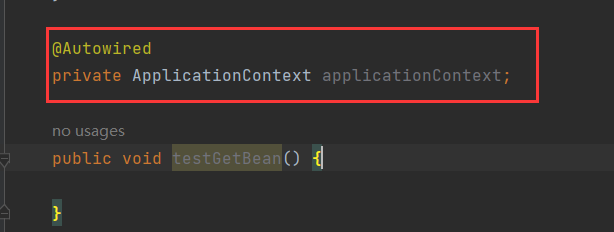

> 然后调用IOC对象的方法来获取Bean，首先是通过名称来获取Bean：


> 比如，我们获取DeptController的Bean，我们前面说过，Bean的名字默认是类名的首字母小写，因此：


> 还可以通过类型来获取Bean：


> 通过类型和名称来获取Bean：


> 测试：


> 3个Bean都是同一个：


> 这说明IOC中这个类型的Bean只有一个，也就是默认情况下，这个Bean是单例的。那么可以将这个Bean改成多例吗？
>
> 答案是可以的，这涉及到Bean的作用域。


# Bean的作用域

> 在IOC容器中，存储的Bean默认是单例。我们所声明的Bean对象到底是多例还是单例，取决于Bean的作用域。
>
> 在spring中，我们所声明的Bean支持5种作用域：

| 作用域                             | 说明                                          |
| ---------------------------------- | --------------------------------------------- |
| <font color='red'>singleton</font> | 容器内同名称的bean 只有一个实例(单例) (默认)  |
| <font color='red'>prototype</font> | 每次使用该bean时会创建新的实例(非单例)        |
| request                            | 每个请求范围内会创建新的实例(web环境中，了解) |
| session                            | 每个会话范围内会创建新的实例(web环境中，了解) |
| application                        | 每个应用范围内会创建新的实例(web环境中，了解) |

> 我们只需关注前两个作用域即可。
>
> 首先是singleton，它是Bean的默认作用域，它表示容器中的同名Bean只有一个，它是单例的。
>
> 第二个是prototype，prototype表示该Bean不是单例的，我们每次使用这个Bean都会创建新的实例。


## 配置作用域

> 我们可以使用@Scope注解来配置Bean的作用域，作用在类上，例如：

```java
@Scope("prototype") // 声明DeptController类型的bean的作用域为prototype
@RestController
@SLF4J
@RequestMapping("/depts")
public Result DeptController(){
    ...
}
```

> 测试，打印10次Bean，首先在默认作用域下：


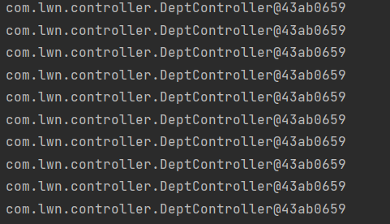

> 可以看到，10次Bean都是同一个，即在默认作用域singleton下，Bean是单例的。接下来我们在DeptController上声明该Bean的作用域为prototype：

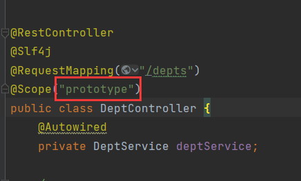

> 再次测试：


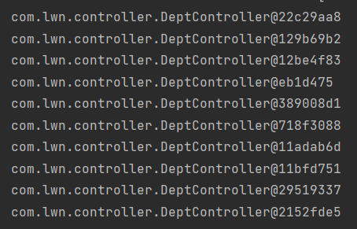

> 每次打印的Bean都是不同的，可见，prototype作用域下的Bean是多例的。
>
> 我们定义DeptController的构造方法，在默认作用域下：

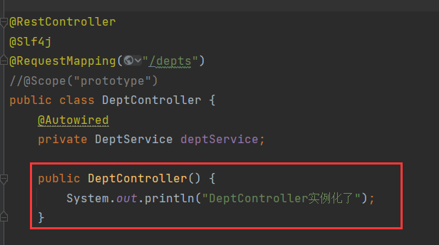

> 此时，我们debug执行，在for循环开始前打上断点：


> 控制台：

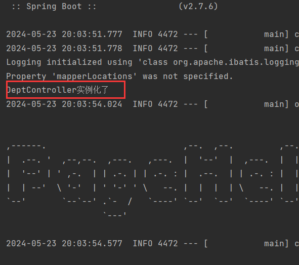

> 在spring环境加载的时候，DeptController就已经被实例化了。循环内执行时就再也没有实例化过：


> 然后我们在prototype下测试：

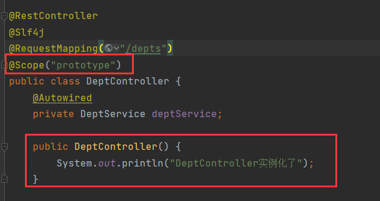

> spring环境加载时，并没有实例化DeptController。

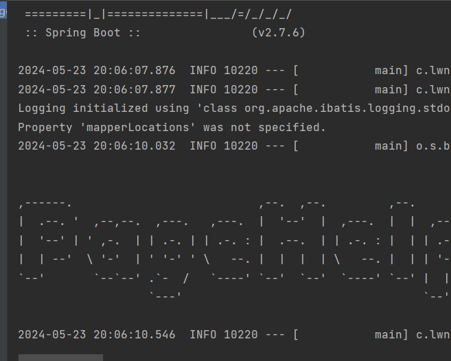

> 只有当我们执行循环内获取DeptController的Bean的时候，才会实例化DeptController，而且每循环一次，就实例化一次：


> 由此可见，默认作用域下Bean是单例的原因是因为，只实例化了一次Bean，而prototype作用域下的Bean，在每一次使用前都会实例化，这也就是造成了每次创建的Bean都是不同的，也就是多例的原因。
>
> 默认作用域下Bean的实例化是在spring环境的加载的时候完成的，这与饿汉单例类获取实例类似，我们可以在类上声明@Lazy注解，让这个类延迟实例化，不在spring环境加载时实例化，而是延迟到第一次使用时才实例化，这与懒汉单例类获取实例类似。

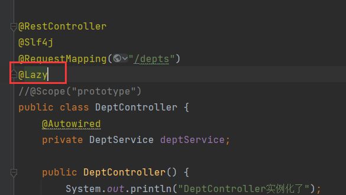

> 现在spring环境加载时，并没有执行DeptController的构造器：


> 而是在第一次使用时才执行构造器：

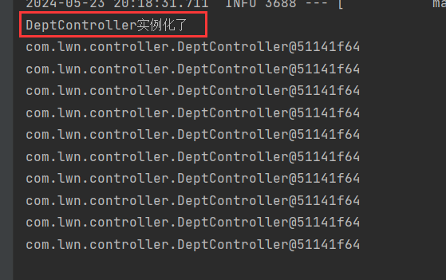


# 第三方Bean

> 当我们使用第三方资源，比如dom4j。

```xml
<!--dom4j-->
<dependency>
    <groupId>org.dom4j</groupId>
    <artifactId>dom4j</artifactId>
    <version>2.1.3</version>
</dependency>
```

> 引入其依赖后，我们就可以对xml文件进行操作：

```java
@Test
public void testBean1() throws DocumentException {
    SAXReader saxReader = new SAXReader();
	// 获取文档对象
    Document document = saxReader.read(this.getClass().getClassLoader().getResource("1.xml"));
    // 获取根元素对象
    Element rootElement = document.getRootElement();
    // 通过子元素名获取子元素的值
    String name = rootElement.element("name").getText();
    String age = rootElement.element("age").getText();
    System.out.println(name + "," + age);
}
```

> 这段代码就是读取xml文件，然后对xml中的文件内容进行解析。然而每一次解析都需要新创建一个SAXReader实例，这样操作是比较耗费资源的。我们现在使用的是spring框架，就不必在每次使用时都来new一个SAXReader对象，我们完全可以将其交给IOC来管理。
>
> 我们之前的操作是在类上声明@Component和其3个衍生注解来将类交给IOC，但是对于第三方类就不能使用这个方法了。因为第三方资源都是已经被保护起来了，源码中我们的权限为只读，无法对源码进行修改：


## @Bean

> 如果要管理的bean对象来自于第三方(不是自定义的) ，是无法用@Component及衍生注解声明bean的，此时就需要用到@Bean注解。
>
> 如何使用@Bean来创建第三方的Bean？一个最简单的方法就是在启动类中定义一个方法，该方法的返回值为需要声明的为Bean的类型，然后在方法上声明@Bean，例如：


> 声明@Bean后，spring框架会自动调用该方法，并且会将方法的返回值交给IOC，成为Bean。
>
> 测试一下，使用原始的new对象的方法：


> xml内容：

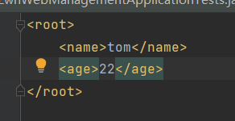

> 结果：


> 然后使用我们定义的Bean：


> 上面的演示中，我们直接将第三方Bean定义在启动类中，这种方式不建议。我们需要尽量保证启动类的纯粹性，它只是用来启动项目的。
>
> 如果我们需要定义第三方@Bean，我们建议单独定义一个配置类，在配置类中对第三方Bean进行集中的配置管理。例如：

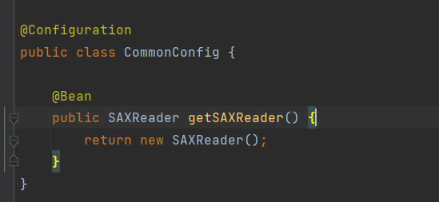

> 测试，依然成功：

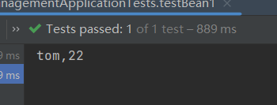

> 之前说过，使用@Component和衍生注解定义Bean都是有默认名的，是类名的首字母小写。但是使用@Bean声明的第三方Bean，它的名字是怎么样的呢？
>
> 在@Bean中有两个属性可以来声明Bena的名称：value和name：

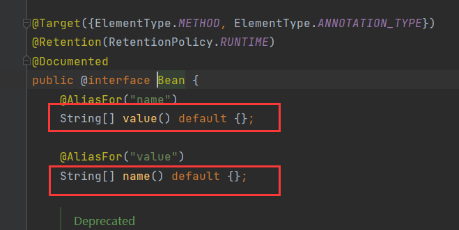

> value指定名称，而name指定别名。
>
> 但是一般我们不会指定第三方Bean的名称，而如果我们没有指定，那么@Bean声明的Bean其名称，默认为方法名。
>
> 比如我们上面声明的getSAXReader方法，该SAXReader类的Bean名称就是getSAXReader：


> 测试，从IOC中获取getSAXReader：


> 一旦我们换一个名称，就无法获取Bean：


> 如果我们需要在第三方Bean中进行依赖注入该怎么做呢？我们只需要在方法形参中声明需要注入的资源即可。
>
> 比如我们现在需要注入一个DeptService，我们在getSAXReader方法中声明DeptService类型的参数即可，spring会自动到IOC中去查找对应类型的Bean然后将其注入，这是自动装配的过程：


> 然后我们随便运行一个单元测试，执行单元测试会先加载springboot环境，一旦加载了环境就会自动调用getSAXReader方法，我们只需查看环境加载过程中有没有注入DeptService：


> 注入成功。


# 注意

> - singleton作用域的Bean，在容器启动时被创建，可以使用@Lazy注解来延迟初始化( 延迟到第一次使用时) 。
> - prototype的bean，每一次使用该bean的时候都会创建一个新的实例。
> - 实际开发当中，绝大部分的Bean是单例的，也就是说绝大部分Bean不需要配置scope属性。
> - 通过@Bean注解的name或value属性可以声明bean的名称，如果不指定，默认bean的名称就是方法名。
> - 如果第三方bean需要依赖其它bean对象，直接在bean定义方法中设置形参即可，容器会根据类型自动装配。
