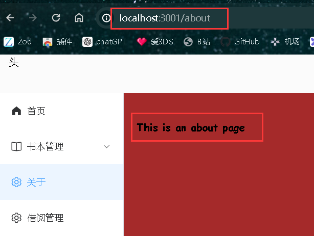

在封装axios请求时，设置在每次请求中携带JWT，当登录成功端下发JWT后。而校验JWT的工作是在后端完成的，如果JWT不存在或失效，那么后端返回一个这样格式的响应数据：

```JSON
{
    "code": 0,
    "msg": "NOT_LOGIN",
    "data": null
}
```

然后axios拦截器拦截响应，判断响应是否为这个格式的数据，如果是代表用户未登录，重定向到login页面。

为什么要做这样的校验？是为了避免用户未登录的情况下访问到需要登录后才能访问的资源。需要注意的是，后端对JWT的校验是对请求的校验，而不是对路由的校验。什么意思呢？就是说路由和请求是两个东西，不能将这两个东西搞混。这里有一个思维误区，很容易将路由和请求认为是一个东西。

举个例子，当用户访问/book这个路径的资源的时候，假设此时用户未登录，那么根据后端校验JWT，前端会重定向到登录页面。这里的校验对象是/book路径对应的资源下的请求，而不是对/book这个路由进行校验。因为/book的页面内存在页面加载完成时执行的钩子，会去异步请求后端的资源，所以当用户访问/book时，由于未登录，异步请求中没有携带JWT，后端校验不通过才导致页面重定向到登录页面。也就是说导致重定向的操作不是用户去访问/book，而是页面中的请求。如果，/book的页面内不存在异步请求，而是一个静态资源，那么是不是说在未登录的情况下也能访问/book页面？因为页面内不存在异步请求，也就不会去发送请求，自然不会对JWT进行校验。比如这样：



访问/about路径，/about的资源下就只有一段文字，没有任何请求。也就是后端什么请求也接收不到：


既然请求都没有发，也就不会对JWT进行校验，那么即使用户未登录也能访问到/about页面，可/about页面如果是需要登录才能访问的资源呢，这是存在问题的。为什么会存在这个问题？是因为我们只对请求进行了JWT校验，而没有对路由进行校验，就是因为我们错误的认为路由和请求是一个东西，就理所当然的的认为在访问路由时就是在发请求，而实际上，访问路由不是在发请求。

对路由进行JWT校验，可以使用路由守卫对路由进行判断：

```js
router.beforeEach((to, from, next) => {
    // 这里进行权限验证
    if (to.path === '/about') {
        // 假设需要验证
        const isAuthenticated = false // 这里应该是你的验证逻辑
        if (!isAuthenticated) {
            next('/') // 如果未验证通过，跳转到首页
        } else {
            next() // 继续导航
        }
    } else {
        next() // 继续导航
    }
})
```

beforeEach是全局前置守卫，它在每次导航之前执行。函数中的三个变量：

- to，即将要进入的目标路由对象（Route对象），包含目标路由的信息。
- from，当前导航正要离开的路由对象（Route对象），包含当前路由的信息。
- next，用于控制导航的函数，可以决定导航的去向。

比如，当前的路由是/about，然后用户访问/book，那么to就是/book，from就是/about，而next是决定导航是否放行，以及放行到哪里去。

因此我们可以使用全局前置守卫来对路由进行JWT校验：

```js
router.beforeEach((to, from, next) => {
    let jwt = localStorage.getItem("token") // 获取JWT
    // to和from是一个Route对象，要获取路径，需要调用path属性
    if(to.path !== "/login" && !validJWT(jwt)){
        // 如果访问的路径不是登陆页面且校验jwt不通过，则导航到登录页
        next("/login")
    } else{
        // 否则放行
        next()
    }
})

// 传入一个JWT字符串
const validJWT = (jwt) => {
    // 对JWT进行校验，校验成功返回true，否则返回false
}
```

前端校验jwt不方便，得后端校验，因此推荐路由守卫中只校验jwt是否存在，然后放行路由，让页面中的异步请求去校验。如果该页面没有页面加载时发起的异步，而是用户操作才能发起的异步，那么建议在该页面中定义一个专门校验jwt的异步请求，然后在页面加载完成后去发送异步请求。

```js
router.beforeEach(async (to, from, next) => {
  if (to.path === "/login") {
    next()
  } else {
    const jwt = localStorage.getItem("jwtKey");
    if (jwt) {
      next();
    } else {
      next("/login")
    }
  }
})
```

