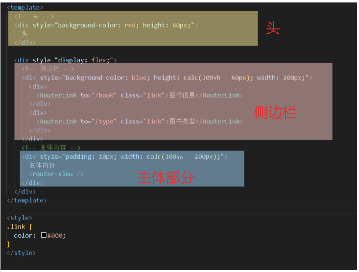
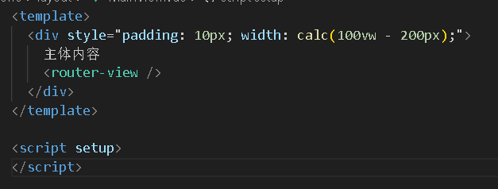
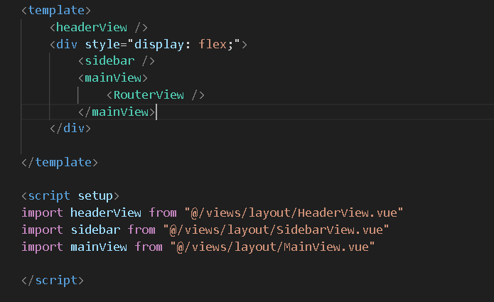
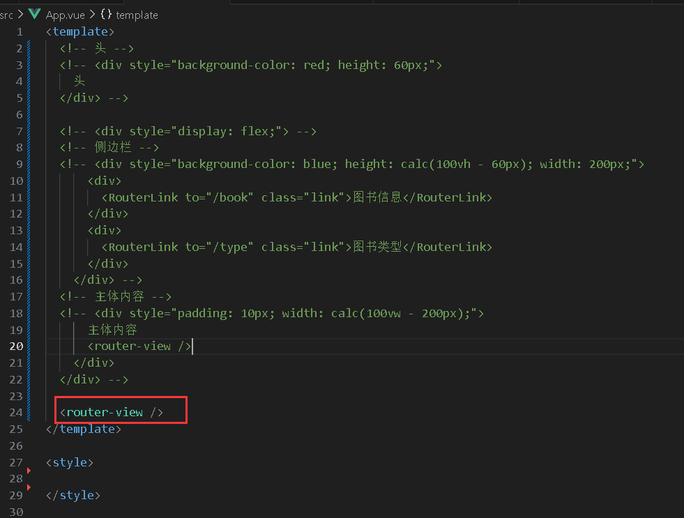
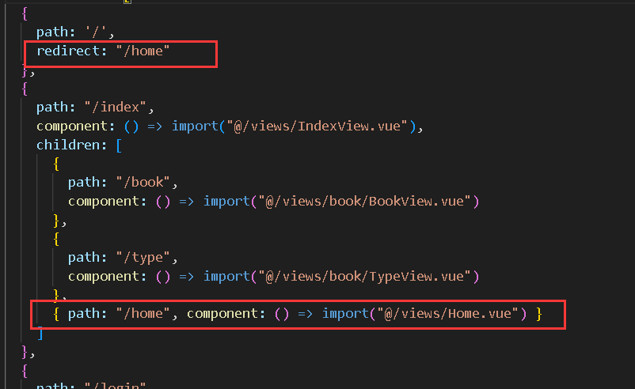

路由对象有一个属性：children，它可以设置该路由的子路由。比如：

```js

const routes = [
    {
        path: "/demo1",
        component: () => import("@/views/demo1.vue"),
        children: [
            {
                path: "/demo2",
        		component: () => import("@/views/demo2.vue"),
            },
            {
                path: "/demo3",
        		component: () => import("@/views/demo3.vue"),
            }
        ]
    }
]
```

demo2和demo3就是demo1的子路由。

在介绍子路由之间，先来看一下案例。

vue的所有渲染最终都会挂载到根组件：App.vue上面去。我们一般会在App.vue中定义`<router-view />`，通过路由访问的资源都会由`<router-view />`显示出来。

当我们将页面的布局全部定义在App.vue中时，比如：



在侧边栏中，定义了两个菜单book和type，通过路由来访问，最终会在主体部分显示出来：


效果：

-1717414898446-1.gif)

但是，当我们访问登录页面时就会出现问题，登录的路由是/login：

-1717415113681-3.gif)

可以看见，登录的页面在主体内容中呈现，但是这不是我们想要的结果。登录页面应该作为一个独立的页面呈现，而不应该在主体内容中呈现。造成这个现象的原因就是我们将布局定义在了App.vue中。当访问/login，路由就会去访问/login路径对应的登录页面的组件，并将组件的内容通过`<router-view />`展示出来，但是App.vue中除了`<router-view />`还有我们自定义的其他布局内容，这些内容也会展示出来，这才导致登录页面在主体内容中呈现。

解决这个问题很简单，只要保证App.vue中只有`<router-view />`即可。至于布局，我们可以将布局定义在其他组件中，并通过路由控制，在App.vue中呈现出来。比如，我将布局抽离出来：

header：


sidebar：


main：



整体的布局index，将header、sidebar、main导入其中：



保证App.vue中只有`<router-view />`：



在路由中定义index组件的访问：

```js
{
    path: "/index",
    component: () => import("@/views/IndexView.vue"),
}
```

这样，我们就可以通过/index来返回布局页面：

-1717416117657-5.gif)

访问/login，也是在独立的页面，而不在主体内容中：

-1717416240307-7.gif)

但是这里有一个问题，访问根路径/时，页面没有任何内容。一般登录成功后，都会跳转到/路径下，而根路径下都是一些首页或主页等，这正好是index布局组件要展示的内容，因此我们可以将/重定向到/index，即访问/就是去访问首页或是主页：


-1717416656266-9.gif)

但是还有另一个问题，当我访问菜单的内容时，页面呈现了一个独立的菜单内容，而不是在主体内容中呈现：

-1717416884970-11.gif)

通过演示内容，我们可以看出，菜单内容渲染到的地方是App.vue的`<router-view />`，而不是mian.vue的`<router-view />`：


我们想要的并不是所有的组件都要在App中渲染，部分组件比如菜单组件应该在main中进行渲染。这就需要使用子路由的功能了，***定义子路由，可以控制子路由对应的组件在父级路由对应的组件中渲染，通过父级组件中定义的`<router-view />`展示出来***。我们要让菜单内容在index的主体内容中进行渲染，那么index就是父级路由，而菜单内容就是子路由：


效果：

-1717417793150-13.gif)

这里有一个歧义的地方，就是定义了子路由，就容易理解为访问对应资源时需要在路由前面加父级路由，比如访问/book需要这样：/index/book，但这是不对的，上面的演示中就可以看出，要访问子路由，直接访问该路径即可，不需要在前面加父级路由，而且这样访问也访问不了任何资源：


当我们直接访问子路径时，其父路径对应的组件也会被渲染出来，比如直接访问/book，其父级路由对应的组件index也会渲染出来：

-1717429154316-1.gif)

利用这个特性，如果我们访问/路径时不想重定向到/index下，而是重定向到/home下，而展示首页的同时又要展示布局页面，我们就可以将其设为/index的子路由：



-1717429519261-3.gif)

子路由必须依靠父级路由的组件定义`<router-view />`才能显示，/index父级中如果我删除`<router-view />`，那么子路由组件就不会显示在页面上：


-1717486865752-1.gif)