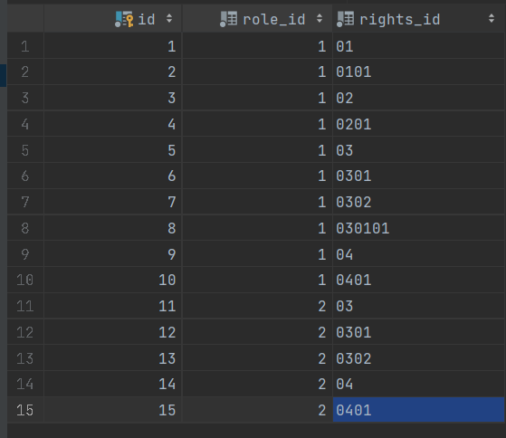
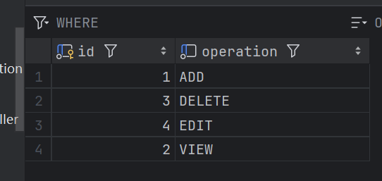

# 权限控制的表

现在的权限控制主流采用RBAC模型，也就是用户-角色-权限。

用户与权限之间隔着一个角色。权限分配给角色，角色再分配给用户，从而间接使得用户具有权限。

一般简单的RBAC模型有4张表：

1、用户表，用户表中需要一个字段来关联角色表：


2、角色表：


3、权限表：这张表不仅仅只维护权限，还维护了前端中的路由路径、菜单图标等等：


4、角色权限中间表，是角色与权限之间关系的维护表：



复杂一点的RBAC模型会将权限表拆分，比如将第三张表的rights字段独立出去，单独设置一张表来维护权限，比如操作权限表，再通过一张中间表与第三张表进行关联：



操作与权限的关联：


我们查询rights表时，顺带查询出每个权限对应的操作：

```sql
select r.*,
       (select operation from operation o where o.id = ro.operation_id) a
from rights r join rights_operation ro on r.id = ro.rights_id;
```


但是这种查询方法会导致同一个权限不同的操作并不会聚合成一行：


因此我们可以采用MySQL的GROUP_CONCAT函数，将多个行值合并为一行，并将某个字段的值用逗号分隔：

```sql
SELECT r.*,
       (SELECT GROUP_CONCAT(o.operation ORDER BY o.operation separator ',')
        FROM operation o
                 left JOIN rights_operation ro ON o.id = ro.operation_id
        WHERE ro.rights_id = r.id) AS a
FROM rights r;
```


于是，我们就可以将rights表的rights字段删除了，最终的效果：

```sql
SELECT id, auth_name, icon, parent_id, path, 
       (SELECT GROUP_CONCAT(o.operation ORDER BY o.operation separator ',')
        FROM operation o
                 left JOIN rights_operation ro ON o.id = ro.operation_id
        WHERE ro.rights_id = r.id) rights
FROM rights r;
```


