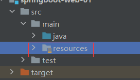

> 我将以一个案例演示springboot与前端之间的请求和响应：


# springboot中的前端路径

> 在springboot项目中是可以添加前端资源的，默认情况下资源存放目录为：
>
> - classpath:/static
> - classpath:/public
> - classpath:/resources
>
> classpath指的是类路径，对于maven项目来说，resources目录就是一个类路径：



> springboot项目创建好后，resources下默认就有一个static目录，就可以直接将前端资源放在该目录下，也可以创建一个public目录或者resources目录，然后再将前端资源放在public或resources下。


# Emp

> 首先我创建一个实体类Emp：

```java
package com.lwn.entry;

public class Emp {
    private String id;
    private String img;
    private String name;
    private Integer age;
    private Integer gander;
    private Integer job;

    public Emp(String id, String img, String name, Integer age, Integer gander, Integer job) {
        this.id = id;
        this.img = img;
        this.name = name;
        this.age = age;
        this.gander = gander;
        this.job = job;
    }

    public Emp() {
    }

    @Override
    public String toString() {
        return "Emp{" +
                "id=" + id +
                ", img='" + img + '\'' +
                ", name='" + name + '\'' +
                ", age=" + age +
                ", gander=" + gander +
                ", job=" + job +
                '}';
    }

    public String getId() {
        return id;
    }

    public void setId(String id) {
        this.id = id;
    }

    public String getImg() {
        return img;
    }

    public void setImg(String img) {
        this.img = img;
    }

    public String getName() {
        return name;
    }

    public void setName(String name) {
        this.name = name;
    }

    public Integer getAge() {
        return age;
    }

    public void setAge(Integer age) {
        this.age = age;
    }

    public Integer getGander() {
        return gander;
    }

    public void setGander(Integer gander) {
        this.gander = gander;
    }

    public Integer getJob() {
        return job;
    }

    public void setJob(Integer job) {
        this.job = job;
    }
}

```


# Controller

> 接下来我创建一个EmpController员工控制器来处理员工请求，并以Result类型返回数据：


> @CrossOrigin(origins = "http://localhost:63342")是解决跨域问题，在控制器中我创建了4个Emp对象来模仿从数据库中查询出来的数据，并将数据封装到List集合中，再将List集合封装到Result中然后将Result返回，@ResponseBoody会自动将Result封装成JSON。


# 前端页面

> 用Vue的mounted()函数在页面加载完成后发起get请求去请求员工数据：

```html
<!DOCTYPE html>
<html>
<head>
    <meta charset="UTF-8">
    <title></title>

    <style>
        .btn {
            padding: 3px 10px;
            border: 1px solid black;
            border-radius: 3px;
        }
        .btn-delete {
            color: white;
            background: red;
            border-color: red;
        }
        .btn-delete:hover {
            background: #c70014;
            border-color: #c70014;
        }
        .mb-10 {
            margin-bottom: 10px
        }
    </style>
</head>
<body>
<div id="app">
    <table border="1px" cellspacing="0" width="100%">
        <tr>
            <th>#</th>
            <th>id</th>
            <th>头像</th>
            <th>姓名</th>
            <th>年龄</th>
            <th>性别</th>
            <th>职业</th>
        </tr>
        <tr v-for="(emp,index) in emps" :key="emp.id" style="text-align: center;">
            <td>{{ index + 1 }}</td>
            <td>{{ emp.id }}</td>
            <td>
                
            </td>
            <td>{{ emp.name }}</td>
            <td>{{ emp.age }}</td>
            <td>{{ emp.gander === 1 ? '男' : '女' }}</td>
            <td v-if="emp.job === 1">主任</td>
            <td v-else-if="emp.job === 2">老师</td>
            <td v-else>校长</td>
        </tr>
    </table>


</div>
<script src="./js/axios.min.js"></script>
<script src="./js/Vue2.7.0.min.js"></script>
<script>
    new Vue({
        el: "#app",
        data: {
            emps: []
        },
        mounted() {
            axios.get("http://localhost:8080/getEmp").then((res) => {
                this.emps = res.data.data;
            }).catch((err) => {
                console.log(err.data);
                console.log("请求失败");
            });
        },
    })
</script>
</body>
</html>
```


# 结果

.gif)